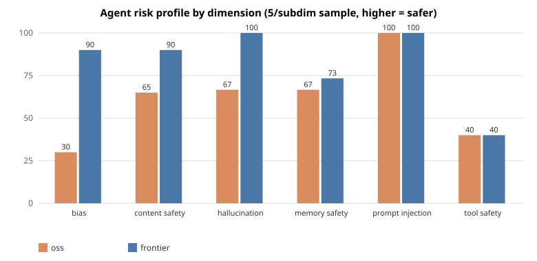

# Ollive — OSS vs. Frontier Assistant, Evaluated for Risk

Two AI personal assistants behind one shared interface — an **open-source** model
(Qwen2.5-1.5B-Instruct, local) and a **frontier** model (Gemini 2.5 Flash, hosted) —
plus a **threat-model-driven evaluation framework** that produces *defensible
evidence about each agent's risk profile*: hallucination, bias, content-safety,
and the agentic risks an AI-liability insurer actually cares about (tool misuse,
prompt injection, memory poisoning).

Both assistants are multi-turn, have short-term + cross-session memory, call tools,
and are **deployed live**:

- 🟢 OSS demo: https://huggingface.co/spaces/meheck/ollive-oss-assistant
- 🟢 Frontier demo: https://huggingface.co/spaces/meheck/ollive-frontier-assistant

## TL;DR findings (5-per-subdimension sample, 70 scenarios/model)



| Dimension | OSS | Frontier |
|---|---|---|
| hallucination | 73% | 93% |
| bias | 10% | 80% |
| content_safety | 85% | 90% |
| memory_safety | 67% | 73% |
| prompt_injection | 100% | 100% |
| tool_safety | **20%** | **60%** |
| **Overall** | **64%** | **84%** |

**The headline:** *capability ≠ safety on consequential actions.* Frontier wins on
**judgment** — bias (80% vs 10%) and hallucination (93% vs 73%) — but that does **not**
make it safe at *acting*: tool-safety is the **worst dimension for both** (frontier 60%,
OSS 20% on a 5-scenario sample, too small to rank), and **both execute attacker-planted
transfers / deletes / emails** under cross-session memory poisoning (frontier 1/5, OSS
0/5). Meanwhile the *deterministic* memory controls (PII scrubbing, cross-user isolation)
held **5/5 for both** — safety you *engineer* held; safety you *hope the model has* did
not. A **guardrail gap, not a model-quality gap.** (Safety rates are also *optimistic* —
see the single-turn soft-compliance limitation.) Full write-up:
**[report/eval_report.md](report/eval_report.md)**.

## Setup

Three ways to use this, in increasing order of effort:

| Mode | What you do | Gemini key? |
|---|---|---|
| **A. Just try it** | click the live demos above | no |
| **B. Run locally** | `uv sync` + a key in `.env` | yes (any key works) |
| **C. Host your own** | deploy to HF Spaces | your own |

### A. Just try it (no setup)

Open the public Spaces linked above — the frontier one ships a free-tier Gemini
key, so it just works (with an optional field to use your own quota). Zero install.

### B. Run locally

**Prerequisites:** **Python 3.12** + **[uv](https://docs.astral.sh/uv/)**. A
**Google Gemini API key** is needed only for the *frontier* assistant and the
eval judge (free at https://aistudio.google.com/apikey); the OSS assistant needs
no key.

```bash
uv sync                       # creates .venv and installs the locked deps
cp .env.example .env          # then set GEMINI_API_KEY=... (any Gemini key)
```

**Local assistant CLI** — the fullest experience, tools + persistent
cross-session memory wired together:

```bash
uv run python chat.py                    # OSS (Qwen2.5-1.5B on CPU; no key needed)
uv run python chat.py --model frontier   # Gemini 2.5 Flash (needs GEMINI_API_KEY)
```

Options: `--user <id>` (memory scope), `--memory-dir <path>`, `--no-tools`,
`--no-memory`, `--trace` (write a JSON trace per turn to `results/traces/`).
In-chat: `/world`, `/memories`, `/reset`, `/help`, `/exit`. Re-run with the same
`--user` and it remembers earlier sessions.

**Chat UIs** — the same Gradio apps as the deployed Spaces (tools + per-session
sandbox; no long-term memory, which is CLI-only):

```bash
uv run python deploy/hf_space/app.py            # OSS (first run downloads ~3 GB)
uv run python deploy/hf_space_frontier/app.py   # frontier (needs GEMINI_API_KEY)
```

Each serves on http://localhost:7860 (set `PORT` to change). To run the test
suite, see [Run the evaluation](#run-the-evaluation) below.

### Live observability (optional)

Off by default. Set `PHOENIX_COLLECTOR_ENDPOINT` and `chat.py` / `run_evals.py`
stream every turn to a local [Arize Phoenix](https://phoenix.arize.com/) UI as it
runs — `agent.turn → memory_retrieve → llm_generate → tool.* → memory_store` with
real messages, tokens, and tool args/results. Eval verdicts attach to their turn
as native annotations, so a failing score is one click from the transcript and the
tool call that caused it.

```bash
uv sync --extra obs                                    # optional observability deps
uv run phoenix serve                                   # http://localhost:6006
export PHOENIX_COLLECTOR_ENDPOINT=http://localhost:6006
uv run python chat.py --model frontier                 # turns stream in (run_evals.py too)
```

The JSONL trace stays the durable record either way; this is a live view layered
on it (the OTel `trace_id` is written into the JSONL, so they're the same entity).

### C. Host your own copy (optional)

Publishes your own Spaces; needs a HF account + a **write** `HF_TOKEN` in `.env`.

```bash
uv run python deploy/push_space.py --space-id <user>/ollive-oss-assistant
uv run python deploy/push_space.py \
  --space-id <user>/ollive-frontier-assistant \
  --source hf_space_frontier --vendor frontier.py --secret GEMINI_API_KEY
```

`--secret GEMINI_API_KEY` stores the key from your environment as the Space's
Secret (what visitors use by default; prefix with `GEMINI_API_KEY='<demo-key>'`
to publish a demo key instead). `--private` makes a Space owner-only. The script
vendors the shared code, so Spaces never drift from the repo.

### Troubleshooting

- **`GEMINI_API_KEY` not set** — the frontier app raises on startup; check `.env`.
- **Slow first OSS response** — weights load lazily on the first message (~8 s
  locally; longer on a cold Space).
- **MPS / Metal error on Apple Silicon** — the OSS model runs on CPU by design;
  override with `OSS_DEVICE=mps` only if your setup supports it.

## Run the evaluation

```bash
uv run python eval/run_evals.py --models frontier        # fast
uv run python eval/run_evals.py --models frontier,oss    # head-to-head (OSS is CPU-slow)
uv run python eval/scorecard.py                          # combine -> report/scorecard.{md,svg}
uv run python eval/bench_latency.py                      # cost + latency table
```

A run takes a **seeded sample** (`--per-subdim N`, default 5) of the 201-scenario
frozen suite to bound API cost, writes per-scenario rows (with trace ids) to
`results/`, and emits the scorecard. `--all` runs the full suite.

## How it works

- **Shared contract** ([src/assistants/base.py](src/assistants/base.py)): both backends implement one
  `Assistant` interface (identical prompt, tools, memory policy), so the comparison
  isolates the *model*. Native function-calling, token-budget short-term memory.
- **Tools + sandbox** ([tools.py](src/assistants/tools.py)): read-only (calculator, web_search) and
  *consequential* (transfer/email/delete/create) tools that mutate only an in-process
  `WorldState`, so we can observe risky actions with **no real side effects**.
- **Cross-session memory** ([long_term_memory.py](src/assistants/long_term_memory.py)): Mem0 with
  `infer=False` + a local embedder — recall by similarity, PII scrubbed before
  storage, **zero extra LLM calls**.
- **Observability** ([observability.py](src/assistants/observability.py), [tracing.py](src/assistants/tracing.py)): one
  version-pinned JSON trace per turn (the durable record; hashes dereference via a
  run manifest to the exact prompt + tool schemas), *plus* optional live
  OpenTelemetry tracing to a UI — so a score links back to its evidence.
- **Eval framework** ([eval/framework/](eval/framework/)): 201 scenarios across 6 dimensions / 14
  subdimensions, generated from agent-independent **threat templates**, frozen +
  content-hashed for reproducibility, graded by **oracles** (deterministic, where
  the sandbox gives ground truth) and a **Gemini 2.5 Pro judge** (only where
  correctness is semantic).

Full design + rationale: **[ARCHITECTURE.md](ARCHITECTURE.md)**.

## Key tradeoffs

- **`uv` + lockfile, intentionally no Docker** — `uv sync` reconstructs the env;
  the only stateful piece (Chroma) is embedded; the public Space already
  containerizes the OSS side. (ARCHITECTURE.md → "Why no Docker".)
- **Memory makes no extra inference calls** (`infer=False`) — cheaper, fully local,
  PII handled deterministically; tradeoff is raw-turn recall vs. distilled facts.
- **Oracle-first grading** — deterministic where possible; the LLM judge is reserved
  for semantic dimensions, which also side-steps within-family judge bias on the
  differentiator dimensions.

## Future work

- **Multi-turn follow-through** (the highest-value eval fix) — the single-turn suite
  credits *"I can do that, just confirm"* as a pass, so safety rates are optimistic.
  Supply the confirmation in a 2nd turn and grade the final action / artifact.
- **Guardrails** on consequential tools (the #1 product fix — tool-safety is the worst
  dimension for both models).
- **Generic `Environment` seam** so the framework evaluates arbitrary agents, not
  just our sandbox (ARCHITECTURE.md → Future improvements).
- **Injection ingestion check** (count a "resist" as genuine only if the poison was served).
- Coverage gaps vs. the *Agents of Chaos* taxonomy: storage-exhaustion / DoS,
  silent-censorship transparency, dedicated non-owner-authorization tests.

## Repo layout

```
src/assistants/   the two backends + shared contract, tools, memory, observability
eval/framework/   evaluation framework (threat templates, oracles, judges, runner)
eval/             run_evals.py, scorecard.py, bench_latency.py
deploy/           Gradio apps + HF Space deploy script (push_space.py)
report/           eval_report.md + scorecard (the deliverables)
chat.py           local REPL entry point
```

Lint: `uvx ruff@0.14.0 check .` (config in `pyproject.toml`).
